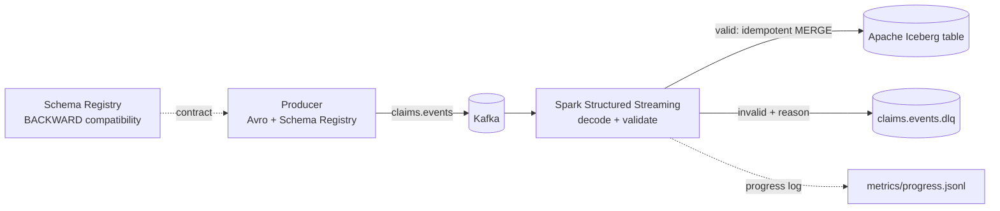

# Real-Time Claims Event Pipeline

A streaming pipeline for health-insurance claim events: **Kafka** -> **Spark Structured Streaming** -> **Apache Iceberg**,
with the data contract enforced by **Confluent Schema Registry** and invalid records routed to a **dead-letter topic**
instead of being dropped. Everything runs locally with Docker; the data is synthetic.



## What it demonstrates

| Concern | How it is handled |
|---|---|
| **Data contract** | Avro schema registered with `BACKWARD` compatibility. `make evolve-ok` is accepted, `make evolve-bad` is rejected. |
| **Bad data** | Every record is checked for wire format, schema id, Avro decode, and 9 business rules. Failures go to `claims.events.dlq` with error codes and the original bytes (base64) so they can be replayed. |
| **Delivery guarantee** | Kafka offsets are checkpointed (at-least-once). Iceberg writes use `MERGE ... WHEN NOT MATCHED` on `claim_event_id`, so replays do not duplicate rows. |
| **Monitoring** | A `StreamingQueryListener` writes per-batch throughput to `metrics/progress.jsonl`; `make metrics` summarizes it. |
| **Testing** | Rules, generator, registry client and metrics are unit tested. A parity test checks the Spark rule expressions against the Python rules. |

## Quick start

Requirements: Docker Desktop, Python 3.11+, `make` (on Windows use WSL, or copy the commands from the `Makefile`).

```bash
python -m venv .venv && source .venv/bin/activate
pip install -r requirements-dev.txt

make up          # Kafka + Schema Registry
make topics      # claims.events and claims.events.dlq
make schema      # register the contract (BACKWARD compatibility)

make stream      # terminal 1: Spark streaming job (first run downloads jars; takes a few minutes)
make produce     # terminal 2: 200k events at ~5k/s, 2% deliberately bad

make report      # row counts, duplicates, latency
make metrics     # Spark throughput summary
make dlq-peek    # a few dead-lettered records
make evolve-ok && make evolve-bad    # schema evolution demo
make down        # stop everything
```

Run only the unit tests (no Docker needed): `make test` (or `pytest -q`).

## Repository layout

```
schemas/          Avro contract + a compatible and a breaking v2
src/claims/       rules.py, spark_rules.py, generator.py, producer.py, schema_registry.py, metrics.py
spark/            streaming_job.py (the pipeline), query_table.py (report)
tests/            pytest (the Spark parity test needs pyspark + Java and skips itself otherwise)
docker-compose.yml, Makefile
docs/RESULTS.md   estimated results and how each was derived
```

## Results

> **Estimated values.** Derived from service limits, the pipeline configuration and typical laptop performance; actual figures vary by machine and environment.

| Metric | Estimated |
|---|---|
| Producer rate | ~5,000 events/s (target) |
| Spark sustained throughput | ~3,000-8,000 rows/s (ceiling 10,000/s by config) |
| Event-to-table latency p95 | ~15-30 s |
| Dead-letter share | ~2% (matches injected bad data) |
| Duplicates after forced restart | 0 |
| Unit tests | 86 cases + Spark parity test |

## Known limitations

- The job decodes with a single schema version (the latest at startup) and sends records written with any other schema id to the DLQ as `schema_id_mismatch`. Safely mixing versions in one topic needs schema-id-aware decoding; the intended upgrade path is drain, restart on the new version.
- Single-node Kafka and a local Hadoop-catalog Iceberg warehouse. A production setup would use multiple brokers and an object-store catalog (Glue, Nessie, or REST).
- Throughput depends heavily on your machine, so record the hardware next to any number.
